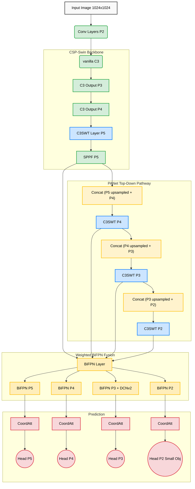

<div align="center">
  <h1>🦅 SwinYOLO: Swin-Transformer-Based YOLOv5 for Small-Object Detection</h1>
  <p>
    An enhanced architecture built on top of YOLOv5, explicitly optimized for dense, high-resolution remote sensing imagery and small-object detection.
  </p>
</div>

## 📌 Overview

This repository takes inspiration from the research paper **"Swin-Transformer-Based YOLOv5 for Small-Object Detection in Remote Sensing Images"** *(Sensors 2023, 23, 3634)* and implements a modified architecture that differs from the original design.

While vanilla YOLOv5 excels at generalized object detection, its performance falters on exceptionally dense clusters and small symbols commonly found in aerial photography, drones, and high-resolution maps. SwinYOLO upgrades the traditional CSPDarknet footprint natively, adding a marginal ~0.4M parameters in exchange for robust spatial awareness and tiny-object acuity. 

## ✨ Key Architectural Enhancements

SwinYOLO improves upon the baseline YOLOv5s architecture through five fundamental modifications:

1. **CIOU K-Means Anchoring**: Upgraded initial bounding box clustering logic utilizing Complete-IOU (CIOU) instead of standard Euclidean mathematics. This factors aspect-ratio scaling to perfectly map dataset-specific anchors.
2. **C3SW-T (Swin Transformer Blocks)**: Replaces traditional Bottleneck convolution logic deep in the network with modified Swin Transformer operations. The self-attention modules maintain proper LayerNorm normalization to ensure numerical stability over long 250-epoch training runs.
3. **BiFPN Cross-Scale Fusion (Hybrid PANet+BiFPN Neck)**: A top-down PANet pathway (Conv+Upsample+C3SWT×3 levels) first generates multi-scale features, which are then fused using EfficientDet's fast normalized weighted BiFPN with Depthwise Separable Convolutions—allowing the network to learn the empirical importance of each scale. DCNv2 deformable convolutions are applied at P3 inside BiFPN for improved spatial alignment on dense small objects.
4. **Coordinate Attention (CA)**: Precise spatial positional data is injected adjacent to the detection heads bounding both the X and Y coordinate planes. 
5. **4-Tier Detection Head**: Augments the standard 3-scale detection architecture by retaining an ultra-high resolution P2 tracking head exclusively for microscopic symbols.
6. **Deformable Conv v2 (DCNv2)**: Integrated into the BiFPN neck (at the P3 scale) to improve spatial alignment and receptive field adaptability for irregular objects (like rotated vehicles or dense clusters).

---

## 🏗️ Architecture Flow Diagram



---

## 🚀 Quickstart Guide

### 1. Generate Dataset Anchors
Because SwinYOLO relies heavily on tight anchors for dense images, you must generate dataset-specific anchors leveraging CIOU. Update your dataset path in `data/pid.yaml` and run:

```bash
python utils/ciou_kmeans.py --label-dir sld_dataset/SLD_test_data/yolo/train --img-size 1024 --n-clusters 12
```
*Copy the resultant anchors directly into `models/yolov5s_swint.yaml`.*

### 2. Begin Training
Start training directly invoking the newly constructed Swin-Transformer configuration file!
```bash
python train.py \
  --img 1024 \
  --batch 4 \
  --epochs 250 \
  --data data/sld.yaml \
  --cfg models/yolov5s_swint.yaml \
  --hyp data/hyps/hyp.swinyolo-adamw.yaml \
  --optimizer AdamW \
  --cos-lr \
  --weights ""
```
*Weights with matching sizes (like early CNN layers) will be seamlessly migrated from standard YOLOv5s.*

## 📂 Core Component Locations
If you wish to explore the implemented module topologies:
- `models/yolov5s_swint.yaml` - Master routing configuration unifying the components.
- `models/swin_block.py` - Contains `C3SWT` and the LayerNorm-stabilized Swin Transformer.
- `models/bifpn.py` - Contains the `BiFPNLayer` using dynamic parameter scaling and depthwise separated convolutions.
- `models/coord_attention.py` - Contains `CoordAtt` & `CoordAttMulti` global pooling architectures.
- `utils/ciou_kmeans.py` - Anchor generation scripting.
